# Terraform Kubernetes (kops)

Production-grade Kubernetes cluster provisioning on AWS using kops and Terraform.

## Historical Context

This project was built in 2018 when Amazon EKS was either unavailable or in early preview in most regions. At the time, running production Kubernetes on AWS meant bootstrapping your own control plane -- and **kops** was the standard tool for that job.

Rather than relying on `kops create cluster` to generate opaque Terraform, this module takes a **Terraform-native approach**: every resource (ASGs, EBS volumes, IAM roles, TLS certificates, security groups, Ignition configs) is declared explicitly in HCL so the cluster can be managed, versioned, and code-reviewed like any other infrastructure.

This codebase demonstrates deep understanding of Kubernetes internals that managed services intentionally abstract away: etcd cluster topology, PKI certificate chains, node bootstrapping via Ignition, and the full IAM permission surface required by the Kubernetes cloud provider.

> **Note:** For new production workloads, AWS EKS is the recommended path. This repository is preserved as a reference architecture.

## Architecture

<p align="center">
  
</p>

## Features

- **3-AZ HA Master Topology** -- One master per availability zone, each in its own ASG (min=1, max=1) for automatic self-healing
- **Split etcd Clusters** -- Separate EBS-backed volumes for `etcd-main` (cluster state) and `etcd-events` (event stream) to isolate IOPS
- **Full PKI Management** -- Terraform-managed TLS certificate hierarchy for all K8s components (CA, apiserver, kubelet, kube-proxy, scheduler, controller-manager, apiserver-aggregator)
- **CoreOS/Ignition Bootstrapping** -- Nodes provisioned via Ignition configs with systemd units for Docker, nodeup, and automatic updates disabled for stability
- **Cluster Autoscaler** -- Worker ASG tagged for auto-discovery; scales based on pending pod demand
- **kube2iam** -- Pod-level IAM role assumption without distributing AWS credentials
- **Kubernetes Dashboard** -- Cluster visibility and basic management UI
- **kube-state-metrics + Heapster** -- Cluster metrics collection and resource monitoring
- **Flannel CNI (VXLAN)** -- Overlay networking with configurable pod CIDR
- **RBAC Authorization** -- Role-based access control enabled by default
- **Least-Privilege IAM** -- Separate master/node IAM roles with scoped permissions
- **CloudWatch Log Integration** -- Centralized logging via CloudWatch with Kinesis subscription filters

## Prerequisites

- Terraform >= 1.0
- AWS CLI configured with appropriate credentials
- An existing VPC with public and private subnets across 3 AZs
- An S3 bucket for kops state storage
- A Route53 hosted zone for the cluster domain
- SSH key pairs created in AWS for master and node access

## Directory Structure

```
.
├── addons/                          # Kubernetes add-on manifests
│   ├── autoscaler.k8s.io/          # Cluster Autoscaler deployment
│   ├── dashboard.addons.k8s.io/    # Kubernetes Dashboard
│   ├── dns-controller.addons.k8s.io/
│   ├── heapster.addons.k8s.io/     # Heapster metrics
│   ├── kube-dns.addons.k8s.io/     # DNS service
│   ├── kube-state-metrics.addons.k8s.io/
│   ├── kube2iam.addons.k8s.io/     # Pod IAM role management
│   ├── networking.flannel/          # Flannel CNI
│   ├── rbac.addons.k8s.io/         # RBAC bootstrap
│   ├── storage-aws.addons.k8s.io/  # AWS storage classes
│   └── bootstrap-channel.yaml      # Add-on version manifest
├── data/                            # Templates for kops configuration
│   ├── cluster.spec                 # Full cluster specification
│   ├── masters_cluster_spec.tpl     # Master-specific cluster spec
│   ├── masters_kube_env.tpl         # Master kube env for nodeup
│   ├── masters_ig_spec.tpl          # Master instance group spec
│   ├── nodes_cluster_spec.tpl       # Node-specific cluster spec
│   ├── nodes_kube_env.tpl           # Node kube env for nodeup
│   ├── nodes_ig_spec.tpl            # Node instance group spec
│   ├── instancegroup_masters.tpl    # Master instance group definition
│   ├── instancegroup_nodes.tpl      # Node instance group definition
│   ├── issued_keyset.tpl            # PKI issued certificate template
│   ├── private_keyset.tpl           # PKI private key template
│   └── secrets.tpl                  # Token secret template
├── addons.tf                        # Add-on S3 uploads
├── cluster.tf                       # Cluster spec rendering and S3 storage
├── data.tf                          # AMI lookup and data sources
├── etcd.tf                          # Dedicated etcd EBS volumes
├── iam.tf                           # IAM roles, policies, instance profiles
├── ignition.tf                      # CoreOS Ignition configuration
├── logs.tf                          # CloudWatch logging
├── masters.tf                       # Master ASGs, launch configs, ELB
├── nodes.tf                         # Worker ASG and launch config
├── outputs.tf                       # Module outputs
├── secrets.tf                       # K8s component auth tokens
├── sg.tf                            # Security groups and rules
├── tls.tf                           # Full PKI certificate chain
├── variables.tf                     # Input variables
├── versions.tf                      # Terraform and provider constraints
└── Makefile                         # Common terraform commands
```

## Deployment

### 1. Configure Variables

Create a `terraform.tfvars` file:

```hcl
cluster_name               = "k8s.example-platform.com"
env                        = "production"
project_name               = "myproject"
vpc_id                     = "vpc-0example1234567890"
vpc_cidr                   = "10.0.0.0/16"
config_bucket              = "my-kops-state-store"
cluster_zone_id            = "Z0123456789EXAMPLE"
cost_center                = "engineering"

masters_availability_zones = ["us-east-1a", "us-east-1b", "us-east-1c"]
masters_instance_type      = "m5.large"
masters_ssh_key_name       = "k8s-masters"
masters_private_subnet_ids = ["subnet-0example1234567890", "subnet-0example1234567891", "subnet-0example1234567892"]
masters_public_subnets     = ["subnet-0example1234567893", "subnet-0example1234567894", "subnet-0example1234567895"]

nodes_instance_type        = "m5.xlarge"
nodes_ssh_key_name         = "k8s-nodes"
nodes_private_subnet_ids   = ["subnet-0example1234567890", "subnet-0example1234567891", "subnet-0example1234567892"]
nodes_asg_min_size         = 3
nodes_asg_max_size         = 10

private_subnet_ids         = ["subnet-0example1234567890", "subnet-0example1234567891", "subnet-0example1234567892"]
private_subnet_cidrs       = ["10.0.1.0/24", "10.0.2.0/24", "10.0.3.0/24"]
public_subnet_ids          = ["subnet-0example1234567893", "subnet-0example1234567894", "subnet-0example1234567895"]
public_subnet_cidrs        = ["10.0.101.0/24", "10.0.102.0/24", "10.0.103.0/24"]

allowed_ips                = ["10.0.0.0/16"]
```

### 2. Initialize and Apply

```bash
make init
make plan
make apply
```

### 3. Access the Cluster

```bash
# Get the API server endpoint
terraform output api_dns_name

# Configure kubectl
kubectl config set-cluster my-cluster \
  --server=https://$(terraform output -raw api_dns_name) \
  --certificate-authority=ca.crt

kubectl config set-credentials admin \
  --username=$(terraform output -raw api_username) \
  --password=$(terraform output -raw api_password)
```

## Architecture Decisions and Trade-offs

### Why Not Use `kops create cluster --target=terraform`?

The standard kops workflow generates Terraform automatically, but the output is monolithic and hard to customize. By building the Terraform from scratch, this module enables:

- **Modular composition** -- The cluster module can be called from a higher-level root module alongside VPC, DNS, and monitoring infrastructure
- **Fine-grained control** -- Every security group rule, IAM statement, and EBS volume is individually tunable
- **Code review** -- Changes are human-readable diffs, not regenerated blobs

### Split etcd Volumes

Kubernetes uses two etcd clusters: one for core state (pods, services, endpoints) and one for events. By placing these on separate EBS volumes, event churn does not compete with state writes for IOPS -- an important consideration under load.

### Single-Instance ASGs for Masters

Each master runs in its own ASG with `min_size=1, max_size=1`. If a master instance is terminated (spot reclamation, AZ failure, hardware issue), the ASG automatically replaces it. The etcd data persists on the EBS volume and reattaches to the new instance.

### CoreOS with Ignition

CoreOS Container Linux was chosen for its immutable infrastructure model. Ignition configs run at first boot to:
1. Configure Docker
2. Download and run `nodeup` (the kops node bootstrapper)
3. Disable automatic OS updates to prevent unplanned reboots

> **Modern alternative:** Flatcar Container Linux is the actively maintained successor to CoreOS and is a drop-in replacement.

### kube2iam for Pod IAM

Rather than granting the node IAM role broad permissions, kube2iam intercepts EC2 metadata API calls and returns pod-specific temporary credentials. This follows the principle of least privilege at the pod level.

## Lessons Learned: kops vs. EKS

| Aspect | kops (this project) | EKS |
|--------|-------------------|-----|
| **Control plane** | Self-managed masters; full visibility into etcd, API server flags, and scheduler config | AWS-managed; no access to etcd or control plane nodes |
| **Upgrades** | Manual; requires careful etcd backup/restore and rolling master replacement | One-click version upgrades in the console or API |
| **Cost** | No control plane fee (just EC2 for masters) | $0.10/hr per cluster (~$73/mo) |
| **Networking** | Flannel, Calico, or other CNI -- full choice | VPC-CNI (native VPC IPs) or bring your own |
| **IAM integration** | kube2iam or kiam as a workaround | Native IRSA (IAM Roles for Service Accounts) |
| **Operational burden** | High -- you own etcd backups, cert rotation, OS patching | Low -- AWS handles control plane operations |
| **Learning value** | Extremely high -- forces understanding of every K8s component | Moderate -- abstracts away internals |

**Recommendation:** Use EKS for production workloads today. The operational overhead of self-managed masters is rarely justified when EKS handles etcd, API server HA, certificate management, and version upgrades. However, building a cluster from scratch (as in this project) is the best way to deeply understand what Kubernetes actually does under the hood.

## Contributing

1. Fork the repository
2. Create a feature branch (`git checkout -b feature/my-feature`)
3. Run `make lint` to format and validate
4. Commit your changes
5. Open a pull request

## License

This project is licensed under the MIT License. See [LICENSE](LICENSE) for details.
